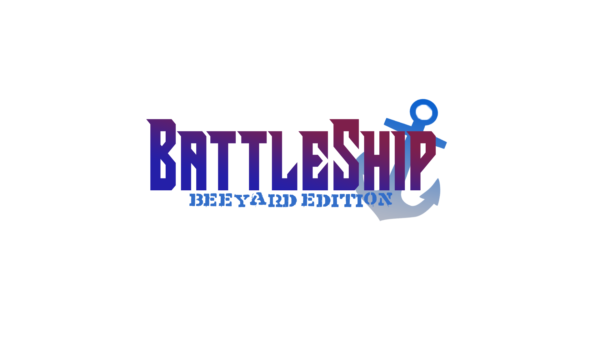
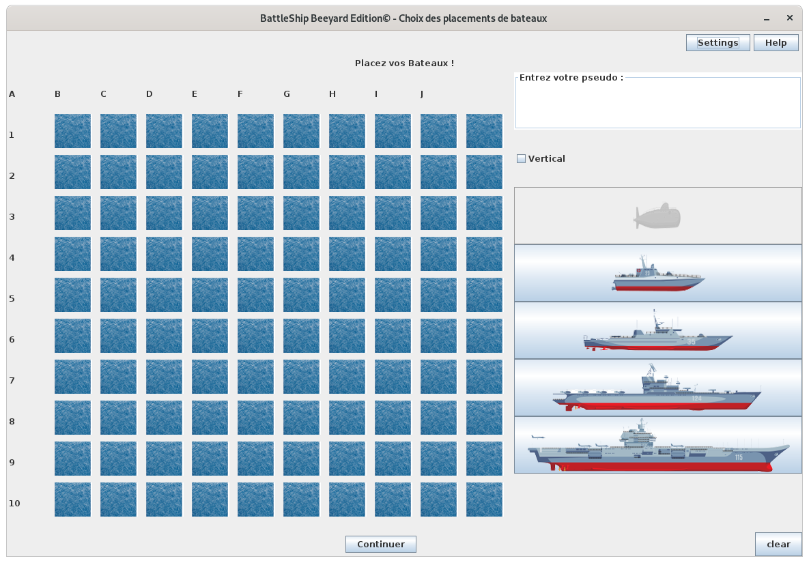

# Projet S2 groupe 18 : BattleShip BeeYard Edition
Voici le logo de notre jeu crée par nos propre soins.

BeeYard fait référence aux nombreux projet de notre groupe, que l'on considère comme notre signature.
## Présentation rapide 
Nous avions à coeurs de créer notre propre identité visuelle à travers différents éléments comme le logo, les bateaux, le plateau mais surtout grâce à ce trailer ci-dessous (de notre propre industrie): https://youtu.be/hwq1m7cqfkU  
[Source : trailer world of warship]
## Menu

Notre menu a été créer de manière à capter l'attention du joueur avec le logo en figure de proue. Il propose plusieurs fonctonnalités comme le bouton 'informations' qui donne toutes les infos nécessaires pour comprendre les règles du jeu ainsi que ses différents modes.

Les deux boutons centrales sont les plus importants, permettant de commencé le jeu ou tout simplement de quitter le jeu.
On retrouve aussi le logo BeeYard (notre signature). 

En bas se trouve une petite phrase de présentation ainsi que le choix entre la version française du jeu et sa version belge. Il suffit de séléctionner la version souhaité.

## Placement des bateaux
Après avoir cliquer sur 'Nouvelle partie' dans le menu, on se retrouve sur la page de placement des bateaux.

Le plateau apparaît donc avec les différents bateaux de la version sélectionné (ici la version française). Il suffit de choisir le bateau voulu et de cliquer sur le plateau pour le placer à l'endroit souhaité. La case du bateau se grise une fois placé. Une checkbox permettant de choisir la position verticale se touve au-dessus des bateaux pour permettre de les mettres en position verticale. Les cases où sont placés les bateaux se grisent aussi.

On peut voir un champ permettant de rentrer son pseudo en haut à droite. Il ya aussi un bouton 'clear' permettant de nettoyer le plateau si on veut changer de configuration navale.

Il suffit ensuite de cliquer sur le bouton 'Continuer' pour passer à l'étape suivante !

## Rejoindre une partie
 
## Gameplay

## Settings/Help

_Image du bateau issue de https://en.wikipedia.org/wiki/French_battleship_Brennus_
