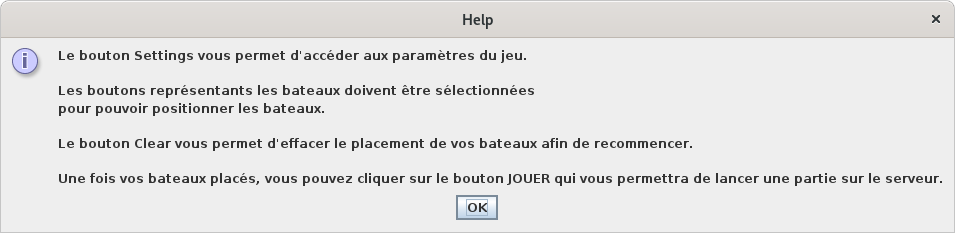
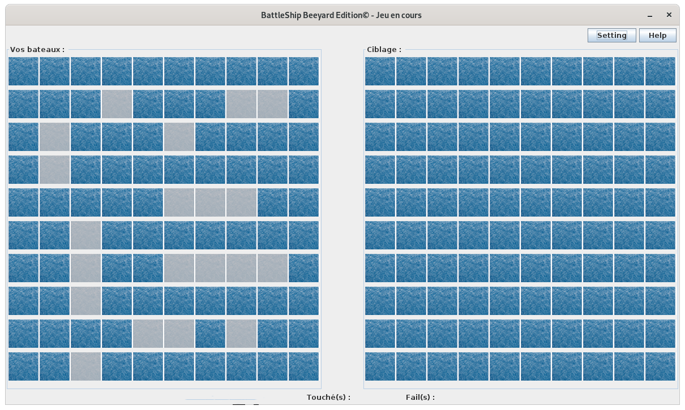
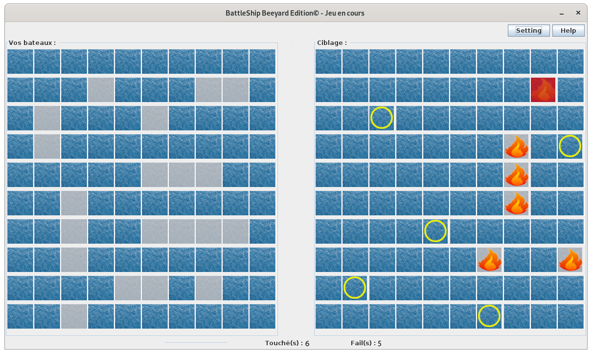

# Projet S2 groupe 18 : BattleShip BeeYard Edition
[ATTENTION : Le proxy se trouve dans le fichier ServeurChoix dans le package vue !]

Voici le logo de notre jeu créé par nos propre soins.

BeeYard fait référence aux nombreux projets de notre groupe, que l'on considère comme notre signature.

## Présentation rapide 
Nous avions à coeurs de créer notre propre identité visuelle à travers différents éléments comme le logo, les bateaux, le plateau mais surtout grâce à ce trailer ci-dessous (de notre propre industrie) : [ https://youtu.be/4yDK0fpvun8 : BATTLESHIP BeeYard Edition TRAILER 2021 ]  
[Source : trailer world of warship]
## Menu

Notre menu a été crée de manière à capter l'attention du joueur avec le logo en figure de proue. Il propose plusieurs fonctonnalités comme le bouton 'informations' qui donne toutes les infos nécessaires pour comprendre les règles du jeu ainsi que ses différents modes.

Les deux boutons centraux sont les plus importants, permettant de commencer le jeu ou tout simplement de quitter le jeu.
On retrouve aussi le logo BeeYard (notre signature). 

En bas, se trouve une petite phrase de présentation ainsi que le choix entre la version française du jeu et sa version belge. Il suffit de sélectionner la version souhaité.

## Placement des bateaux

Après avoir cliquer sur 'Nouvelle partie' dans le menu, on se retrouve sur la page de placement des bateaux.

Le plateau apparaît donc avec les différents bateaux de la version sélectionné (ici la version française). Il suffit de choisir le bateau voulu et de cliquer sur le plateau pour le placer à l'endroit souhaité. La case du bateau se grise une fois placé. Une checkbox permettant de choisir la position verticale se touve au-dessus des bateaux pour permettre de les mettres en position verticale. Les cases où sont placés les bateaux se grisent aussi.

On peut voir un champ permettant de rentrer son pseudo en haut à droite. Il y a aussi un bouton 'clear' permettant de nettoyer le plateau si on veut changer de configuration navale.

Il suffit ensuite au joueur de cliquer sur le bouton 'Continuer' pour passer à l'étape suivante !

## Settings/Help

Avant de passer à l'étape suivante, vous avez pu remarquer l'existence de 2 boutons situés en haut à droite de la fenêtre : Settings et Help.

Settings lance une nouvelle fenêtre permettant plusieurs choix.

On peut donc quitter le jeu à l'aide du bouton 'Quit the Game' ou 
cliquer sur 'Back to the Game' pour revenir au jeu.
Le joueur peut recommencer une partie en cliquant sur 'Restart a game'.s

Ensuite il y a le bouton 'Help'.

Ce bouton indique des informations pertinentes pour le joueur.

## Rejoindre une partie

Une fois vos bateaux placés, le joueur accéde à un nouveau menu.

Ce menu offre le choix de rejoindre une partie déja créée ou de créer une partie.

Si le joueur clique sur 'Rejoindre une partie", il accède à cette fenêtre : 

Il retrouve à gauche la liste des serveurs déja existants. Il lui suffit de sélectionner un serveur et de cliquer sur 'Rejoindre' pour accéder à la partie.

Au contraire, si le joueur souhaite créer une partie, il accède à cette fenêtre :

Le joueur n'a plus qu'à cliquer sur 'Créer la partie' pour commencer.

## Gameplay

La partie peut commencer ! Le plateau de jeu apparaît alors :

On y aperçoit à gauche le plateau de vos bateaux et à droite le plateau des bateaux de votre adversaire. Chacun leur tour, le joueur clique sur case et dévoile la nature de celle-ci :

Il y a différents type de cases : 
- celle avec un rond jaune correspondant à une case sans bateau;
- celle dotée d'une flamme : le joueur a touché un bateau;
- celle dotée d'une flamme sur fond rouge : le joueur a coulé un bateau;

En bas de l'écran, on retrouve des compteurs avec le nombre de bateaux de touchés et le nombre de ratés.

Le joueur gagne quand il a coulé tous les bateaux de son adversaire.

## Victory/Defeat

Si le joueur remporte la partie de BattleShip, il est conduit sur un écran victorieux

Il peut cliquer sur le bouton 'Quitter' pour Quitter une partie.

Si au contraire le joueur perd c'est l'écrans suivant qui apparaît : 

## Fin

Voilà, vous connaissez maintenant tout de BATTLESHIP BeeYard Edition. 
Il ne vous manque plus qu'à vous amuser sur le jeu.

Enfin, n'oubliez pas de soutenir le Trailer du jeu (https://youtu.be/4yDK0fpvun8), cela nous ferait extrêmement plaisir !

   
